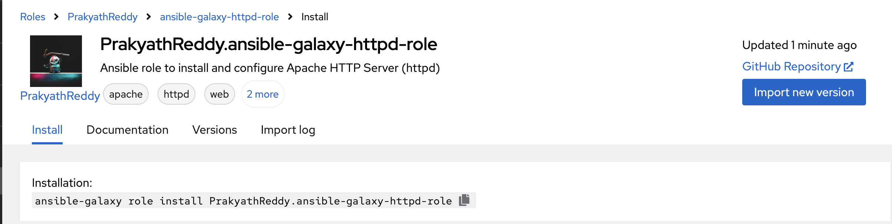

# ansible

install python3 on the control node and nodes that are to be managed by ansible

install ansible on the control node

```bash
pip install --include-deps ansible
```

**ref:** https://docs.ansible.com/ansible/latest/installation_guide/intro_installation.html#control-node-requirements

### Practise exercise 1: Enable password-less authentication

- Create 2 ec2 instances to be managed by ansible control plane (my laptop)

```bash
ssh-copy-id -f "-o IdentityFile <PATH TO PEM FILE>" ubuntu@<INSTANCE-PUBLIC-IP>
```

- Can now connect to the ec2 instance without any password:

```bash
ssh ubuntu@52.87.251.93
```

using password without the pem file:

- login to ec2 instance using instance connect 
- edit the file: /etc/ssh/sshd_config.d/60-cloudimg-settings.conf

```bash
sudo systemctl restart ssh
```

set new password for ubuntu user

```bash
sudo passwd ubuntu
``` 

- from laptop:

```bash
ssh-copy-id ubuntu@<public-ip-of-ec2>
```
- passwordless authentication now enabled

### Ansible inventory

**Ref:** https://docs.ansible.com/ansible/latest/inventory_guide/intro_inventory.html#intro-inventory

2 formats: inventory.ini or yaml

to avoid passing path of inventory.ini, it can rather be stored at the default location: /etc/ansible/hosts

Example adhoc command:

```bash
ansible -i inventory.ini -m ping all
```

- `-i` - inventory location
- `-m` - module  
- `all` - implement on all servers mentioned in inventory file

```bash
ansible -i inventory.ini -m shell -a "apt install openjdk" all
```

Group nodes in inventory file by type, like web, db

```bash
ansible -i inventory.ini -m ping db
```

### adhoc commands

for simple tasks

```bash
ansible -i [location-of-inventory-file] -m [module] -a [argument-to-module] [hosts-to-be-applied-on]
```

**Ref:** https://docs.ansible.com/ansible/latest/command_guide/intro_adhoc.html

Reboot server

```bash
ansible -i inventory.ini db -a "/sbin/reboot"
```

Transfer files

```bash
ansible web -i inventory.ini -m ansible.builtin.copy -a "src=/etc/hosts dest=/tmp/hosts"
```

**Output:**
```json
ubuntu@52.87.251.93 | CHANGED => {
    "ansible_facts": {
        "discovered_interpreter_python": "/usr/bin/python3"
    },
    "changed": true,
    "checksum": "9feb94ca37e5d1554880552bddb6778d964189ab",
    "dest": "/tmp/hosts",
    "gid": 1000,
    "group": "ubuntu",
    "md5sum": "a3f51a033f988bc3c16d343ac53bb25f",
    "mode": "0664",
    "owner": "ubuntu",
    "size": 213,
    "src": "/home/ubuntu/.ansible/tmp/ansible-tmp-1760375288.369268-19671-76341022140233/source",
    "state": "file",
    "uid": 1000
}
```

Ensure a package is installed without installing it

```bash
ansible -i inventory.ini -m ansible.builtin.apt -a "name=acme state=present" web
```

**Output:**
```json
ubuntu@52.87.251.93 | FAILED! => {
    "ansible_facts": {
        "discovered_interpreter_python": "/usr/bin/python3"
    },
    "changed": false,
    "msg": "No package matching 'acme' is available"
}
```

Manage users

```bash
ansible all -i inventory.ini -m ansible.builtin.user -a "name=foo state=absent"
```

**Output:**
```json
ubuntu@52.87.251.93 | SUCCESS => {
    "ansible_facts": {
        "discovered_interpreter_python": "/usr/bin/python3"
    },
    "changed": false,
    "name": "foo",
    "state": "absent"
}
ubuntu@13.218.146.223 | SUCCESS => {
    "ansible_facts": {
        "discovered_interpreter_python": "/usr/bin/python3"
    },
    "changed": false,
    "name": "foo",
    "state": "absent"
}
```

Manage services

```bash
ansible all -m ansible.builtin.service -i inventory.ini -a "name=httpd state=stopped"
```

**Output:**
```json
ubuntu@13.218.146.223 | FAILED! => {
    "ansible_facts": {
        "discovered_interpreter_python": "/usr/bin/python3"
    },
    "changed": false,
    "msg": "Could not find the requested service httpd: host"
}
ubuntu@52.87.251.93 | FAILED! => {
    "ansible_facts": {
        "discovered_interpreter_python": "/usr/bin/python3"
    },
    "changed": false,
    "msg": "Could not find the requested service httpd: host"
}
```

Complete details of setup:

```bash
ansible all -m ansible.builtin.setup -i inventory.ini
```

### Playbooks

Each playbook is a collection of plays 
Ref: https://docs.ansible.com/ansible/latest/playbook_guide/playbooks_intro.html#playbook-execution:~:text=an%20Ansible%20module.-,Playbook%20execution,-%EF%83%81

install-apache.yaml

modules ref: https://docs.ansible.com/ansible/2.9/modules/list_of_all_modules.html
most used ones: https://docs.ansible.com/ansible/latest/collections/ansible/builtin/index.html

```bash
ansible-playbook -i inventory.ini install-apache.yaml
```

**Output:**
```
PLAY [web] *******************************************************************************************************

TASK [Gathering Facts] **********************************************************************************************
ok: [ubuntu@52.87.251.93]

TASK [install apache httpd] *****************************************************************************************
changed: [ubuntu@52.87.251.93]

TASK [copy file with owner and permissions] *************************************************************************
changed: [ubuntu@52.87.251.93]

PLAY RECAP **********************************************************************************************************
ubuntu@52.87.251.93        : ok=3    changed=2    unreachable=0    failed=0    skipped=0    rescued=0    ignored=0   

verified on ec2 instance that:
- index.html file exists in /var/www/html
- service is running $ sudo systemctl status apache2


### Roles

Re-organize above playbook, this time using roles
$ ansible-galaxy role init playbook-using-roles

Ref: https://galaxy.ansible.com/ui/

copy tasks from /play-apache-install and paste in playbook-using-roles/tasks/main.yaml

move index.html file into playbook-using-roles/files
$ mv playbook-apache-install/index.html playbook-using-roles/files 

update path to index.yaml in tasks/main.yaml src field

Re-run:
$ ansible-playbook -i inventory.ini install-apache.yaml 

PLAY [web] *******************************************************************************************************

TASK [Gathering Facts] *******************************************************************************************
ok: [ubuntu@52.87.251.93]

TASK [playbook-using-roles : install apache httpd] ***************************************************************
ok: [ubuntu@52.87.251.93]

TASK [playbook-using-roles : copy file with owner and permissions] ***********************************************
ok: [ubuntu@52.87.251.93]

PLAY RECAP *******************************************************************************************************
ubuntu@52.87.251.93        : ok=3    changed=0    unreachable=0    failed=0    skipped=0    rescued=0    ignored=0
```

### Galaxy

login into galaxy.ansible.com<br>
Roles > docker

Will use Galaxy to install and configure Docker on my 2 managed nodes

```bash
ansible-galaxy role install bsmeding.docker
```

Where to find roles: `~/.ansible/roles`

Create playbook which uses that role to install and configure docker on all my hosts

```bash
ansible-playbook -i inventory.ini playbook-docker.yaml
```

**Output:**
```
PLAY RECAP *********************************************************************
ubuntu@13.218.146.223      : ok=26   changed=8    unreachable=0    failed=0    skipped=10   rescued=0    ignored=0   
ubuntu@52.87.251.93        : ok=26   changed=8    unreachable=0    failed=0    skipped=10   rescued=0    ignored=0
```

Verified that docker running successfully on ec2 instances

### publish install-apache role to galaxy

Create new repo for the role<br>
https://github.com/PrakyathReddy/ansible-galaxy-httpd-role

push to galaxy:

```bash
ansible-galaxy import PrakyathReddy ansible-galaxy-httpd-role --token d66dce7a6addeccd3d30c3e3cf99a62f2c992fcd
```

token can be created for one time use on the galaxy UI

Role can be accessed here:<br>
https://galaxy.ansible.com/ui/standalone/roles/PrakyathReddy/ansible-galaxy-httpd-role/

To install my role:

```bash
ansible-galaxy role install PrakyathReddy.ansible-galaxy-httpd-role
```

